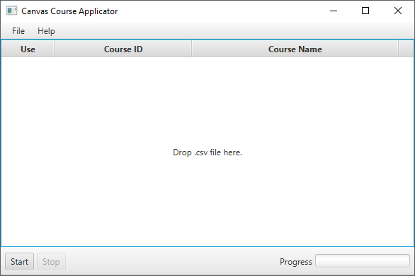
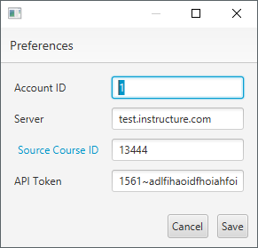
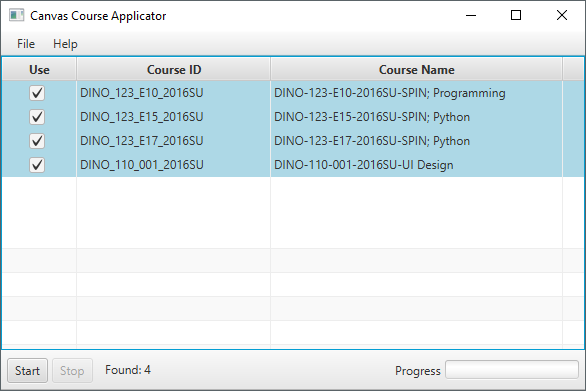

# Canvas Course Applicator (java)

A java app for applying a template to a canvas course.
Works just like it's php counterpart, except has a nice interface.
Drop a csv list of courses onto the app and it will ask canvas 
apply a template course to them.

## Preferences

Enter the information about your Canvas account.

## Drop CSV File

Drop your csv file, select the courses to apply the template to
and press start.

